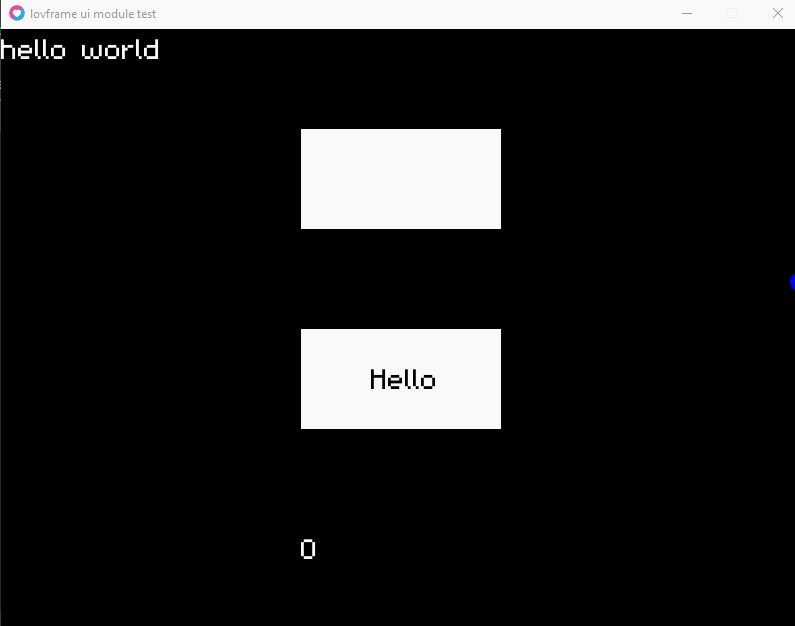

**lovframe-ui**

lovframe-ui is a simple yet awesome ui module for love2d and specifically for lovframe.
The current version of lovframe-ui is v0.1.



What comes in this version? Well i'm glad you asked, This version comes with a simple button and a text button. The simple button is very easy to use

Create A Button:

```lua
require("data/scripts/simple_button")

function love.load()
    button = simple_button:create("type", "mode", x, y, width, height, r, g, b, h_r, h_g, h_b, button)
end

function love.update(dt)
    simple_button:update(dt)
end

function love.draw()
    simple_button:draw()
end
```

Add Button Function:

```lua
require("data/scripts/simple_button")

function love.load()
    button = simple_button:create("type", "mode", x, y, width, height, r, g, b, h_r, h_g, h_b, button)
end

function love.update(dt)
    simple_button:update(dt)
end

-- button function
function print_hello()
    print("hello")
end

function love.onpressed(x, y, button, istouch)
    if simple_button:onpressed(button) then
        print_hello()
    end
end

function love.draw()
    simple_button:draw()
end
```
